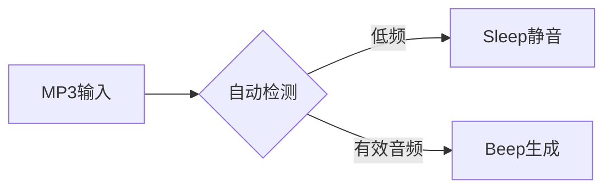

```markdown
# 🎵 MP3-to-Winsound Converter

<div align="center">
  
  
  
</div>

## 🚀 项目概述

将 MP3 音频文件转换为 Windows 系统蜂鸣音效 (`winsound.Beep`) 的 Python 工具，通过分析音频频谱特征，实现主板蜂鸣器播放音乐。

```
python
# 示例输出代码
winsound.Beep(440, 500)  # 播放 440Hz 频率，持续 500ms
```

## ✨ 核心功能

### 🎛️ 音频处理引擎
| 功能 | 描述 |
|------|------|
| 频谱分析 | 采用 STFT 算法 (帧长 2048) |
| 多模式处理 | 固定/动态/自动三种模式 |
| 智能优化 | 自动合并短音调 |

### 📊 可视化界面
```diff
+ 实时频谱曲线
+ 音符持续时间分布
+ 带时间戳的日志系统
```

## 📦 版本演进

### v4.0 (当前版本)


**新增特性：**
- 智能静音检测 (阈值 400Hz)
- 三合一处理算法
- 集成代码预览面板

### v3.0
```python
# 动态处理核心
def process_dynamic():
    freq_avg = sum(freq*dt)/sum(dt)  # 加权平均
    if diff(freq) < 20Hz:            # 可调阈值
        merge_segments()
```

### v2.0
- 首个 GUI 版本
- 实时进度条
- 内存占用降低 30%

## 🛠️ 安装使用

1. 安装依赖：
```bash
pip install librosa numpy soundfile matplotlib
```


3. 界面操作
```
1. 选择 MP3 文件
2. 设置处理参数
3. 生成播放代码
```


## 📜 技术规格

| 组件 | 要求 |
|------|------|
| Python | ≥ 3.7 |
| Librosa | ≥ 0.8.0 |
| 内存 | ≥ 512MB |

(由AI生成)
```
